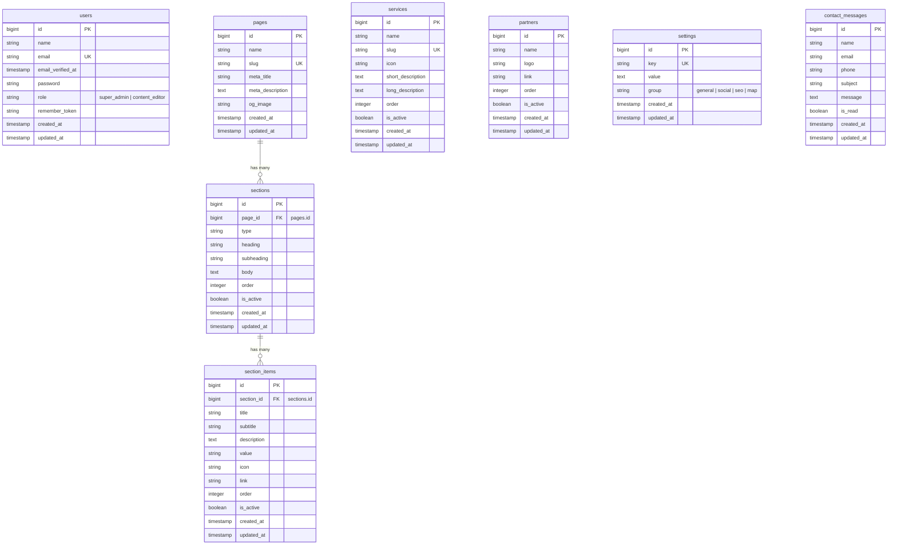

# Database Schema & Entity Relationship Diagram (ERD)
## Mercury Bangladesh (Pvt.) Ltd. — Database Architecture

This document describes the database schema, model definitions, field constraints, and relationships for the Mercury Bangladesh website and CMS.

---

## 1. Entity Relationship Diagram (ERD)

The following Mermaid diagram visualizes the entity relationships across the database:

---

## 2. Table Specifications

### 2.1 `users` (Admin Users)
Stores administration credentials and access level controls.
- **`id`**: Primary Key (BigInt, Auto Increment).
- **`name`**: Full name of the admin user.
- **`email`**: Unique email address used for login authentication.
- **`role`**: Access level string (`super_admin` for system management, `content_editor` for page edits).
- **`password`**: Hashed password.

### 2.2 `pages` (Static Public Pages)
Represents the main public pages of the website.
- **`id`**: Primary Key.
- **`name`**: Descriptive page name (e.g., "Home Page").
- **`slug`**: Unique slug URL locator (e.g., `"home"`, `"about"`, `"services"`, `"contact"`).
- **`meta_title`**: SEO title overrides.
- **`meta_description`**: SEO description meta content.
- **`og_image`**: Open Graph social banner image path.

### 2.3 `sections` (Page Sections)
Each page consists of dynamic sections.
- **`id`**: Primary Key.
- **`page_id`**: Foreign Key referencing `pages.id` (cascades on delete).
- **`type`**: Semantic section identifier (e.g., `"hero"`, `"about_us"`, `"stats"`, `"timeline"`).
- **`heading`**: Main text header for the section.
- **`subheading`**: Small text label or eyebrow above the main heading.
- **`body`**: Rich text or HTML markup block.
- **`order`**: Numeric display ordering index.
- **`is_active`**: Boolean state to easily toggle section visibility.

### 2.4 `section_items` (Repeatable Items inside Sections)
Repeatable elements within section grids (e.g., sliders, tiles, stats counters).
- **`id`**: Primary Key.
- **`section_id`**: Foreign Key referencing `sections.id` (cascades on delete).
- **`title`**: Row title / label.
- **`subtitle`**: Secondary text row.
- **`description`**: Detailed card text.
- **`value`**: Data counters (e.g., `"44"` years, `"100%"` SLA).
- **`icon`**: Font or SVG path icon string.
- **`link`**: Action CTA destination URL.
- **`order`**: Repeatable item sorting index.
- **`is_active`**: Display active status.

### 2.5 `services` (Core Offerings)
Dynamic logistics offerings presented on the services page.
- **`id`**: Primary Key.
- **`name`**: Service name.
- **`slug`**: Unique identifier for potential dedicated detail views.
- **`icon`**: Service visual class representation or key.
- **`short_description`**: Quick abstract view.
- **`long_description`**: Rich HTML content.
- **`order`**: Service presentation index.
- **`is_active`**: Service active toggle.

### 2.6 `partners` (Collaborators / Trust Bar Logos)
List of partner/client logo images.
- **`id`**: Primary Key.
- **`name`**: Partner company name.
- **`logo`**: File path to logotype image.
- **`link`**: Optional partner external website link.
- **`order`**: Left-to-right sorting order.
- **`is_active`**: Visibility flag.

### 2.7 `settings` (Global Site Configuration)
Application-wide variables stored as key-value pairs.
- **`id`**: Primary Key.
- **`key`**: Unique config key identifier (e.g., `"company_phone"`, `"maps_coordinates"`).
- **`value`**: Configuration content.
- **`group`**: Key classification category (e.g., `"general"`, `"social"`, `"seo"`, `"map"`).

### 2.8 `contact_messages` (Inbox Submissions)
Public contact form entries.
- **`id`**: Primary Key.
- **`name`**: Sender name.
- **`email`**: Sender email address.
- **`phone`**: Contact number.
- **`subject`**: Email topic header.
- **`message`**: Body content of the form submission.
- **`is_read`**: Processing flag.
